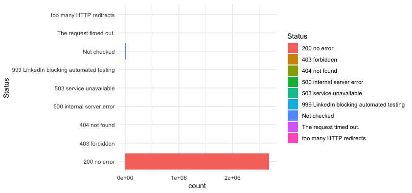
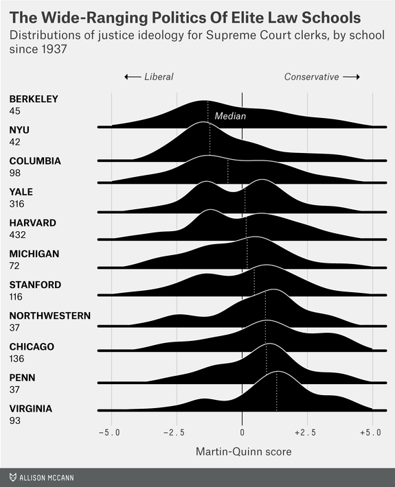
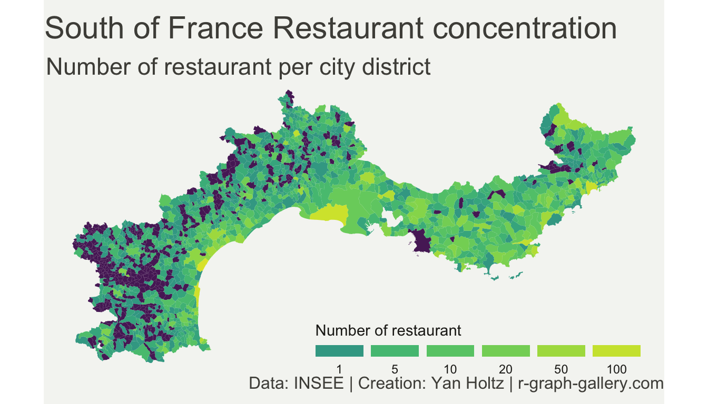

# Using R for SEO, What to expect?

## The power of R'. What's different about it?

**R'** is a high-level programming language that mainly focuses on data analysis. Meaning it's "specialized". With one or a few lines of code, you can do a lot. Let me give you an example:

```r
View(read.csv(file.choose()))
```

This line of code, executed will&#x20;

* prompt a select file menu for you to select a CSV  (_`file.choose`_)
* It will import data inside R (_`read.csv`_)&#x20;
* Display it (_`View`_)

Let's do it with a website links file


This is how you open and **browse a file with 2.6 Million rows effortlessly**. Noticed the small search icon on the top right? Yes, you can search within it quite easily too.


Want to count HTTP code? We will do this in two steps, first we load the same CSV file and save it as a variable. Nearly the same as before:

```r
internal_linking = read.csv(file.choose())
```

Then we are going to display the count of Status column values

```r
View(table(internal_linking$Status))
```

You can recognize the `View` function from before. the `table` function just count values. the **`$`** is a shortcut to access column values

It displays:


This is 30 secondes job. The most time-consuming part was finding the file on the hard disk.&#x20;

Of course, these are just some silly examples. There is countless way to do this thing (third party app, terminal, excel pivot, panda but it gives a nice intro of R' possibilities and how simple that is.

## _'There is a package for that'_

The real power of R relies on R packages. What's a package you may ask?  It's an on-demand library of functions you can load to help you in specialized tasks. Again let's take some examples.

### `ggplot2`

It's one of the most famous packages. it can be used to build advanced charts and plots. To use it, you just have to install it once like this

```r
install.packages("ggplot2")
```

to load it

```r
library("ggplot2")
```

and after that, you can now use it

```r
ggplot(internal_linking)+
  aes(x = Status, fill = Status) +
  geom_bar() +
  scale_fill_hue() +
  theme_minimal()+ 
  coord_flip()
```



Because we only want to see the problematic http codes, we are going to filter&#x20;

```r
internal_linking_filtered <- filter(internal_linking, !(Status %in% c("200 no error", "Not checked","999 LinkedIn blocking automated testing")))
ggplot(internal_linking_filtered)+
  aes(x = Status, fill = Status) +
  geom_bar() +
  scale_fill_hue() +
  theme_minimal()+ 
  coord_flip()

```

.png>)

Let's not go into details for now, but believe it or not, I'm not capable of writing this code, I just googled: "Bar charts chart ggplot" , "flip axis ggplot", ... shamelessly copy-paste the codes.

gggplot2 is powerful, it can make basically every chart you can think of

A few examples of plots done using `ggplot2`

 

 

To see more examples:

* [The R Graph Gallery](https://www.r-graph-gallery.com)`/` [Top 50 ggplot2 Visualizations](http://r-statistics.co/Top50-Ggplot2-Visualizations-MasterList-R-Code.html), some nice code to copy-paste&#x20;
* [Tidy Tuesday](https://github.com/HudsonJamie/tidy\_tuesday), nice to see how far ggplot2 can be pushed

Let's look at another package

### `Lubridate`

[Lubridate](https://lubridate.tidyverse.org) will help to deal with our timestamp values. After the now-classic installing and loading

```r
install.packages("lubridate")
library("lubridate")
```

It can be used to guess and transform this `Time.stamp`into a real date format

```r
internal_linking$real_date = dmy_hms(internal_linking$Time.stamp)
```

Values have been transformed into a true `Date` format.&#x20;


No more "at" in the middle or "am/pm". It's now easier to read and sort.  The `dmy_hms` function guessed successfully that the "at" was useless. &#x20;

Now that those are real dates and no longer character string, we can plot them using `ggplot`

```r
ggplot(internal_linking) +
   aes(x = real_date) +
   geom_histogram() +
   theme_minimal()
```


the `Lubridate` package can also help with duration, time zone, intervals, ... Have a look at the [cheatsheets](https://rawgit.com/rstudio/cheatsheets/master/lubridate.pdf). It is a bit complex to get into but so much less than trying to do it yourself. I've lost literally days of my working life, trying to do this kind of stuff badly in Excel/Google Sheet.

### `urltools`

One last example for the road. 'Want to extract links domains? You can sure use regex, or even try to split the string using "/" as a separator... OR you can use the more reliable `urltools` package which as a dedicated `domain()` function to do exactly that.

```r
# Installing and Loading Package
install.packages("urltools")
library("urltools")
# extract domain and feed it to a new data column called 'domain'
internal_linking$domain <- domain(internal_linking$URL)

```

Let's check out the values, nearly the same code as before:

```r
View(table(internal_linking$domain))
```


### Where to find packages?

Good question! All the previous packages have been downloaded from CRAN. It's a repository that contains [thousands of packages](https://cran.r-project.org/web/packages/available\_packages\_by\_date.html). Github is also a great source. There are so many that,  the problem is often to find the right one. The way to go is usually to ask around using:

* Twitter using the #rstats hashtag
* [rstats subreddit](https://www.reddit.com/r/rstats/)
* [rstudio forum](https://community.rstudio.com)
* There are a couple of nice slacks like the [Measurecamp's one](http://join.measure.chat)

The community is smaller than other programming languages but people are more willing to help, it compensates.

## The confusing things about R

### The name

> _Oh you do '_R programming'_, that's cool. Is it like_ Air Guitar? You do fake programming?\
> \- An anonymous member of my family

"R" is a weird name,  especially in this covid time, and it's not the most Google-friendly name either. So here are few links to help find R resources.

* [https://rseek.org/](https://rseek.org) - R search engine
* [https://www.r-bloggers.com/](https://www.r-bloggers.com) - R blogs aggregator
* [https://www.bigbookofr.com/](https://www.bigbookofr.com) all the R free books
* [https://github.com/search?l=R\&q=seo\&type=code](https://github.com/search?l=R\&q=seo\&type=code) Search github or R source code

### the `<-`&#x20;

If you've seen some R' code before and you might have been surprised to see this "<-"  being used. it's just a legacy thing, historically R differentiates  "assignation"  and "comparison", example:

_assignation -_ If you want to set the value of X to 3.  &#x20;

```r
x <- 3
```

_comparison -_ Is X equal to 3?

```r
if (x = 3) {
    message("the value of X is 3")
}
```

If you want to keep this little _tradition_ alive you can use <- but it is really up to you. Perfectly fine\* to use **=**

```r
x = 3
x <- 3
```

(these are actually [little differences](https://stackoverflow.com/questions/1741820/what-are-the-differences-between-and-assignment-operators-in-r) between the two but if you are new to R it's not important at all.)

#### The `%>%`

The (weird) `%>%` operator allows operations to be carried out successively. Meaning the results of the previous command are the entries for the next one. Like the **>** ( “pipe”) command line for terminal if you came across it.

Always better with an example, let's take the first line of code of this page

```r
View(read.csv(file.choose()))
```

Its 3 functions are used one after the other. The readability is decent. I wouldn't recommend adding a fourth.  the **%>%** operator fixes this soon-to-be problem.

```r
# equivalent to the previous instruction
file.choose() %>% read.csv() %>% View()

# again equivalent
file.choose() %>%
 read.csv() %>%
 View()
```

As you can see, fairly easy to read. This operator is so practical that it's now used by a majority of R practicers.&#x20;

### R' rely a lot on vectors which are confusing

Let's make some

```r
#this instruction Combine 3 numbers to make a vector and define the x variable.
x <- c(1,2,3) 

# this will display our vector
x

# this will concatenate the x vector twice
c(x,x) 

# Unlike tables, vectors first element need to be called with 1
x[1]
```

the good part is you don't need to make a loop every time you need to make some basic operations&#x20;

```r
#this will add one to all vector elements
y <- x+1

#Want to add up 2 vectors with each other? this will work
x+y

# it also works with function
x <- as.double(x)
```
