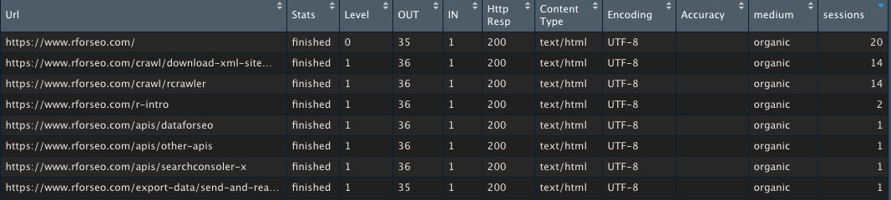

# Join Craw data with Google Analytics Data

The SEO data to be analyzed often comes from different sources that why it's better to know how to connect them. This is what we will see in this article  
  
Let's imagine we have crawled your website, it might be quite nice to check which one of these pages got some SEO traffic. 

To do that we'll need to `merge` or `join` the two "datasets" :

### 1. Crawl data

Using `rcrawler`, we've collected our pages  \(see [How to use rcrawler](../crawl/rcrawler.md) article\)

```r
library(Rcrawler)
Rcrawler(Website = "https://www.rforseo.com/")
```

We now have a dataset \(dataframe\) of urls associated to their crawl depht called `INDEX`

```r
View(INDEX)
```


### 2. Google analytics data

Using `googleAnalyticsR` package we grab Google Analytics SEO Landing page \(see [How so use googleAnalyticsR](../apis/web-analytics-google-analytics.md) article\)

```r

# Between 1 january and 1 feb 2021
# we want the sessions
# we request landing and medium info too 
# and using the anti sampling option

ga <- google_analytics(ga_id, 
    date_range = c("2021-01-01", "2021-02-01"),
    metrics = "sessions",
    dimensions = c("medium","landingPagePath"),

    anti_sample = TRUE)


# We filter the data to only keep the SEO sessions

ga_seo <- ga %>% filter(medium == "organic")
```

### Fuuuuu...sion!

The first step is to define what's the common ground. We have on the crawler data side the `Url` column and on the GA side the `landingPagePath`

So we need to make a conversion.  We'll remove the hostname from the Url using the `path` function `urltools` package. 

```r
INDEX$landingPagePath <- paste0("/",urltools::path(INDEX$Url))

INDEX$landingPagePath[INDEX$landingPagePath == "/NA"] <- "/"
```

and now we can merge

```r
crawl_ga_merged <- merge(INDEX,ga_seo)
```

That's it really. Lets display the data

```r
View(crawl_ga_merged)
```




