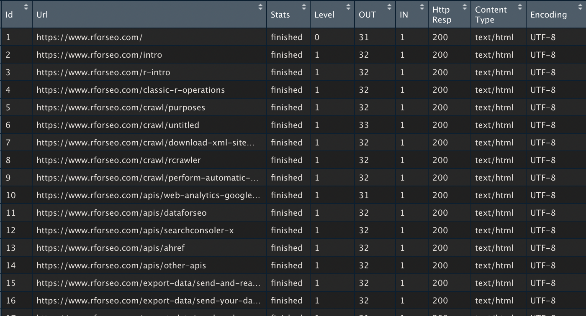

# Join datasets x

If you have crawled your website, it might be quite nice to check which of these pages got some SEO traffic. 

To do that we'll need to link or `join` the two dataset and as you'll see, its quite simple

### First data set : Crawl data

Using `rcrawler`, we've collected our pages  \(see [How to use rcrawler](../crawl/rcrawler.md)\)

```r
library(Rcrawler)
Rcrawler(Website = "https://www.rforseo.com/")
```

We now have a dataset \(dataframe\) of urls associated to their crawl depht called `INDEX`

```r
View(INDEX)
```



### Second data set : Google analytics data

Using `googleAnalyticsR` package we grab Google Analytics SEO Landing page \(see [How so use googleAnalyticsR](../apis/web-analytics-google-analytics.md)\)

```text

# Between 1 january and 1 feb 2021
# we want the sessions
# we request landing and medium info too 
# and using the anti sampling option

ga <- google_analytics(ga_id, 
    date_range = c("2021-01-01", "2021-02-01"),
    metrics = "sessions",
    dimensions = c("medium","landingPagePath"),

    anti_sample = TRUE)


# We filter the data to only keep the SEO sessions

ga_seo <- ga %>% filter(medium == "organic")
```

### Fuuuuu...sion!

First step is to define on what common ground we'll merge the deux dataset

We have on the crawler data side the `Url` column and on the GA side the `landingPagePath`

So we need to make sure they are on the same format. So we'll remote the hostname from the Url using `urltools` package

```text
INDEX$landingPagePath <- paste0("/",urltools::path(INDEX$Url))

INDEX$landingPagePath[INDEX$landingPagePath == "/NA"] <- "/"
```

and now we can merge

```text
merge(INDEX,ga_seo)
```


