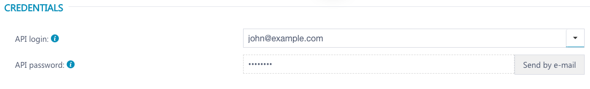

# Grab 'DataForSeo' API data x

### What is DataForSeo?

[DataForSEO](https://dataforseo.com/) is a paid API that provides SEO data

### How to use the API?

First, you need to grab your credentials can be found inside your personal dashboard





```r
# great package for working with HTTP requests
library(httr)

# credentials can be found here https://app.dataforseo.com/api-dashboard
username <- "APILOGIN"
password <- "APIPWD"

headers = c(
  `Authorization` = paste('Basic',base64_enc(paste0(username,":",password))),
  `Content-Type` = 'application/json'
)
```

## Sample request asking for a keywords position

```r
data = '[{"keyword":"r for seo",
           "location_code":2826,
            "language_code":"en",
            "device":"desktop",
            "os":"windows"}]'
```

We are asking  for the position of the keyword "**r for seo**" from an IP in England \(code 2826\) 

all the location code are available [here](https://docs.dataforseo.com/v3/serp/google/locations/?bash)

```r

res <- httr::POST(url = 'https://api.dataforseo.com/v3/serp/google/organic/live/advanced', httr::add_headers(.headers=headers), body = data)


res_text <- content(res, "text")
require(jsonlite)
res_json <- fromJSON(res_text, flatten = TRUE)
View(res_json)
```

