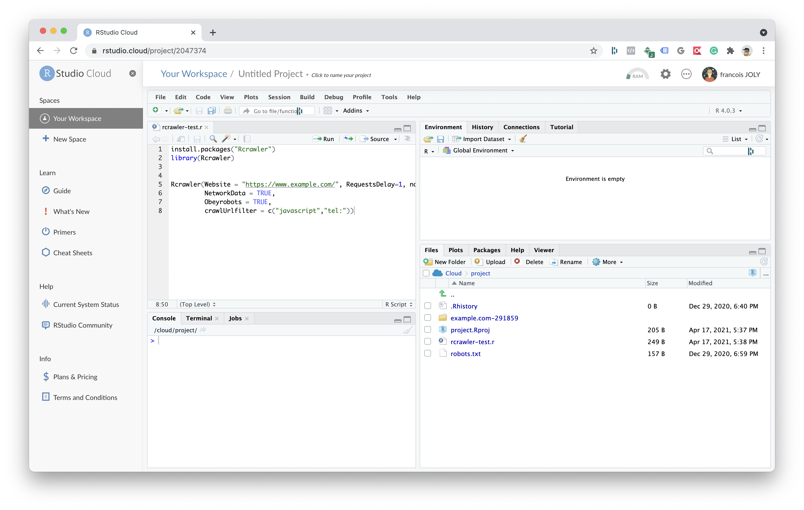

# Getting started X

## Install R and  RStudio

R can be downloaded from the [CRAN website](https://cran.r-project.org/)

After the installation, you can use R on the command line by typing R but it's a bit dry as you can see.


the best way to use R is to use a development environment and most use RStudio. All the example in this book will be using it.

[Here the webpage to download it](https://www.rstudio.com/products/rstudio/download/). 

After install, you'll be ready to go.

if you intend to try this guide scripts you are ready to go. 

### Use RStudio Cloud

There is a 'Cloud' version of RStudio, perfect for a quick demo. For more serious work, there is some [dedicated plans](https://rstudio.cloud/plans/free).



Create an account here [https://rstudio.cloud/](https://rstudio.cloud/)

### Use GoogleColab

This is a little-known option but it's possible to use R inside GoogleColab

Start [_rmagic_](https://rpy2.github.io/doc/latest/html/interactive.html) by executing this in a cell:

```text
%load_ext rpy2.ipython
```

Then start your script by `%%R` to execute

```r
%%R

x <- 1:10

x
# it should display number from 1 to 10
```

[more details about this feature](https://towardsdatascience.com/how-to-use-r-in-google-colab-b6e02d736497)

#### Native R on Google Colab

[https://youtu.be/huAWa0bqxtA](https://youtu.be/huAWa0bqxtA)


