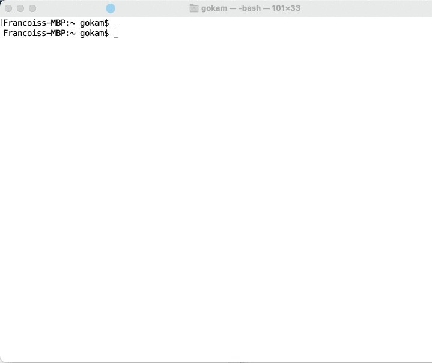

# Getting started

## Install R&#x20;

R can be downloaded from the [CRAN website](https://cran.r-project.org)

After the installation, you'll be able to use R on the command line by typing `r.`

It's a bit dry as you can see.

## Install  RStudio

the best way to use R is to use a development environment and the most widely used is RStudio. All the examples in this book will be using it.

[Here the webpage to download it](https://www.rstudio.com/products/rstudio/download/).

After this installation, you are ready to go 🙌

For the real R beginners, I would recommend to at least to check out in your app where are:

* the Console panel, where you can execute code that is not meant to be store\

* the Source panel, where you can execute R file code. Where any piece of code can be selected and executed.&#x20;

here is [quick youtube demo](https://www.youtube.com/watch?v=MGHjnpj46IU\&t=181s) that might help.

For your culture, you should know that it is also possible to [execute R code online.](ressources/execute-r-code-online.md)

## Next?

Choose from the menu on the left what you want to do. if you want to start with something easy I would recommend the [XML sitemap](crawl/download-xml-sitemaps.md)

