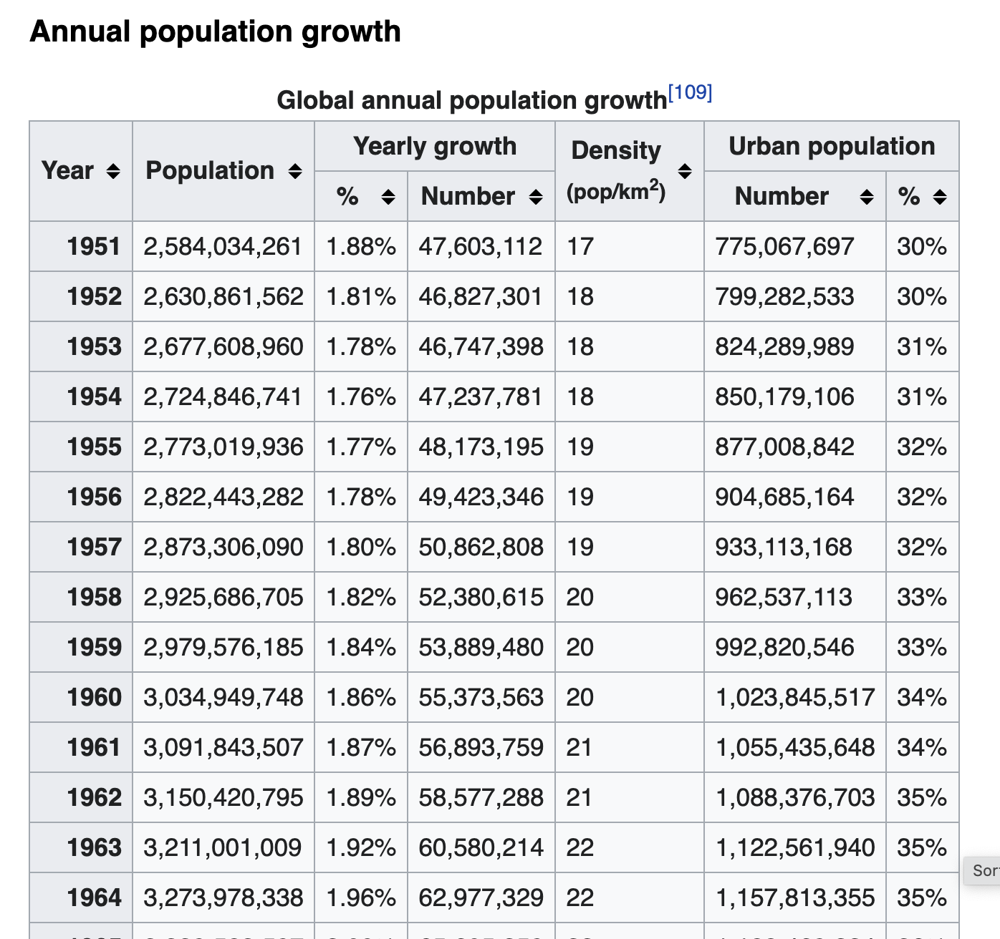

# What's crawling and why is it useful?

### What is crawling?

It's fetching the contents of a web page using an app or a script. This is what Google is doing when its bot explores the web and analyzes webpage content.

### How crawling is useful for SEO?

As someone doing SEO you need to know what you are showing to Google. What your website looks like from a \(Google\) bot perspective. You need to [check the quality of your XML sitemap](download-xml-sitemaps.md) if you are submitting one. You need to [check your website webpages and meta data](rcrawler.md). Checking the web server logs is also a good idea, to know what Google bot is doing on your website.

You can also respectfully crawl your competitors' websites to better understand their SEO strategy.

### Crawling is also interesting to grab data. 

There are some great public datasets out there, even wikipedia is a great source. Let's take this [world population data](https://en.wikipedia.org/wiki/World_population) that can be crawled:



```r
library(dplyr)
library(rvest)
url <- "https://en.wikipedia.org/wiki/World_population"
population <- url %>%
  read_html() %>%
  html_nodes(xpath='//*[@id="mw-content-text"]/div[1]/table[7]') %>%
  html_table() %>%
  as.data.frame()

#removing extra row
population = population[-1,]

# convert to numeric
population$Population <- as.numeric(gsub(",","",population$Population))
population$Year <- as.numeric(population$Year)


```

and displayed as a plot

```r
library(ggplot2)
ggplot(population) +
  aes(x = Year, y = Population) +
  geom_point() +
  theme_minimal() +
  scale_y_continuous(labels = scales::comma)
```

_et voila_


It's not really SEO, but it can be useful. I've also been using it to check the quality of the data on websites, like product prices, image availability, etc.

Again, [Screamingfrog](https://www.screamingfrog.co.uk/) or another crawler might be a better choice, it depends on how integrated you want that to be and how custom those checks should be.

#### 


