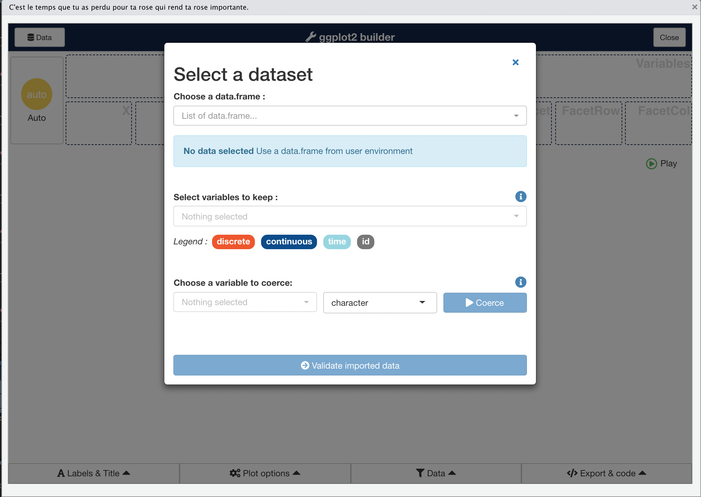
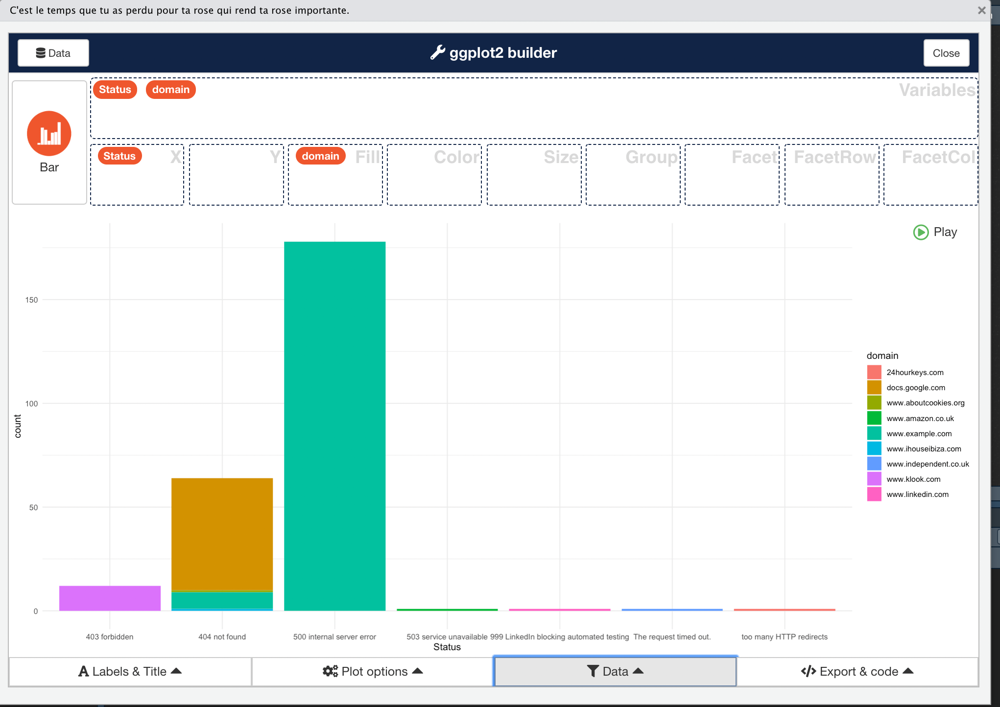
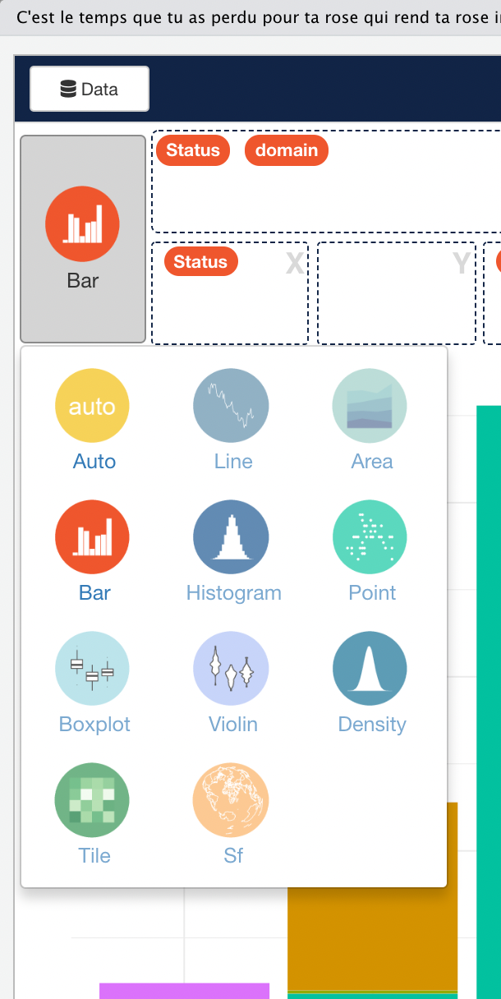
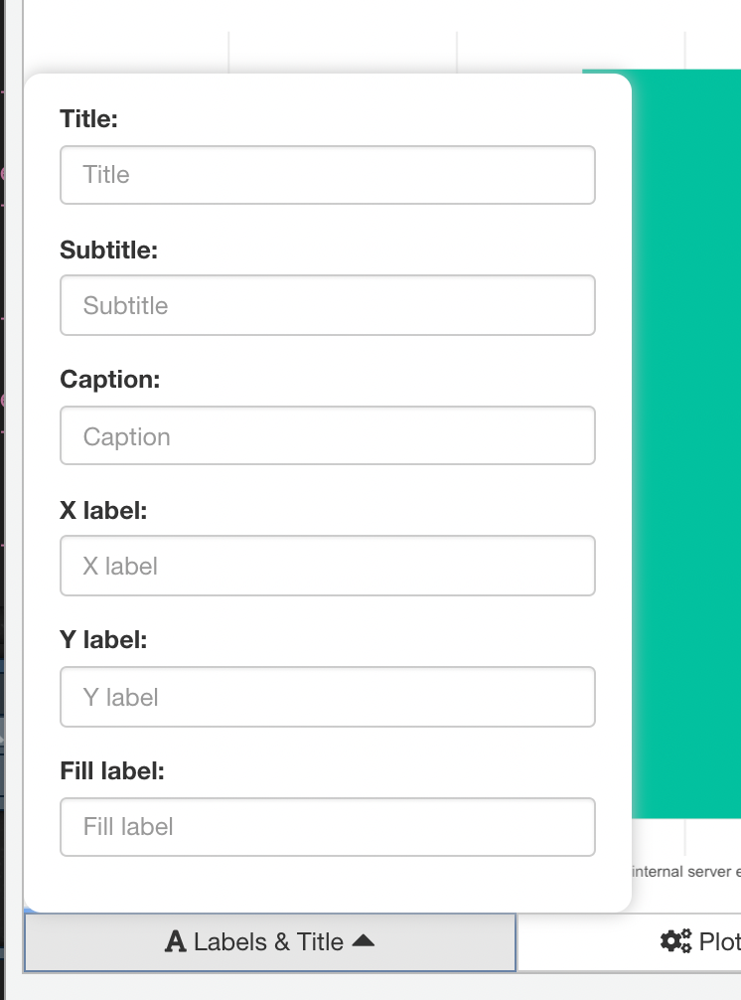
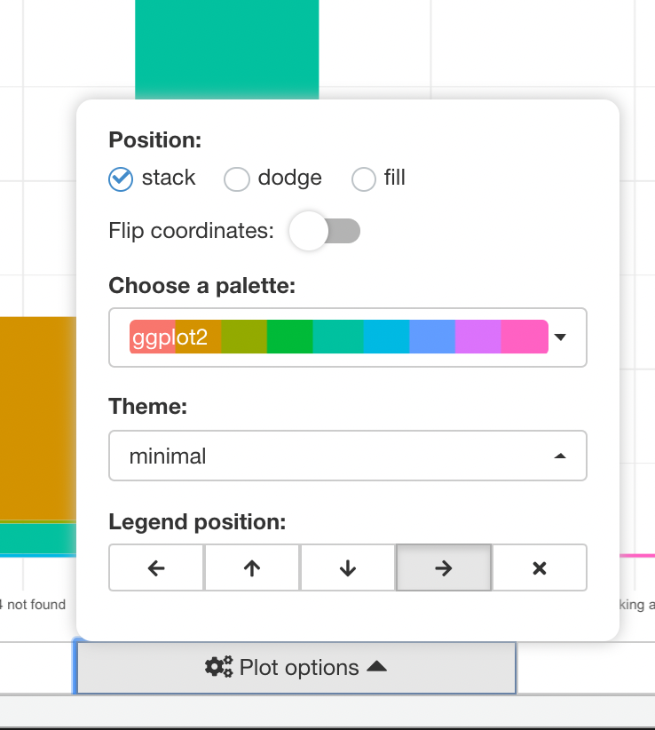
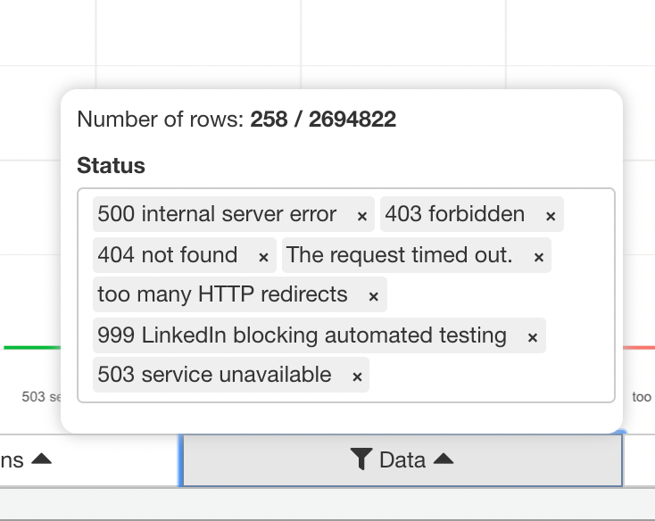
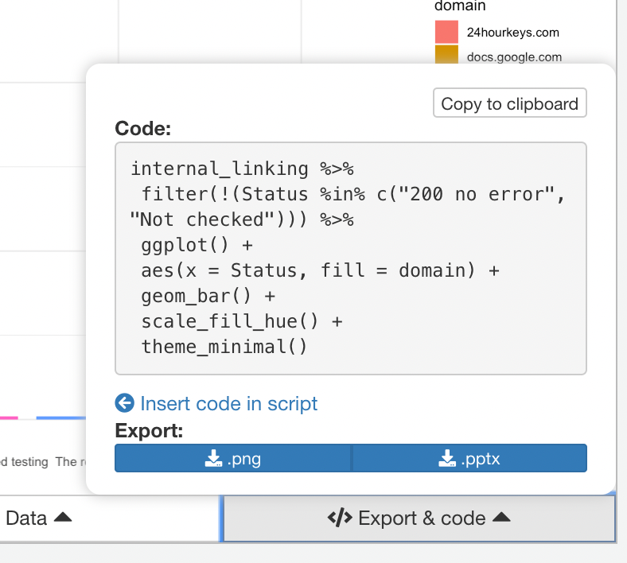

# Use Esquisse to create plots quickly

ggplots is great package but it can be a bit overwhelming to deal with. So many options and functions. Lucky for us, thanks to Fanny Meyer & Victor Perrier, there is a shortcut, the [esquisse package](https://dreamrs.github.io/esquisse/index.html). It basically helps explore your data quickly and build a ggplot.&#x20;

Let me take an example\
\
As always _installing_ and _loading_

```
install.packages("esquisse")
library("esquisse")
```

After that, only one line of code to make the magic happens

```
esquisser()
```



you pick your dataset, the field you want to import and it's now possible to choose what metrics to display on each axis by drag & dropping them into each selector



Pick the plot style



you can also customise the plot titles and legends



you can pick the colors and plot style



Filter the values



Last and foremost, it gives you the code to generate this plot + some extra export option.



Esquisse is not capable of doing every available ggplots but for a simple graph, it's a great way to speed up the processs.
