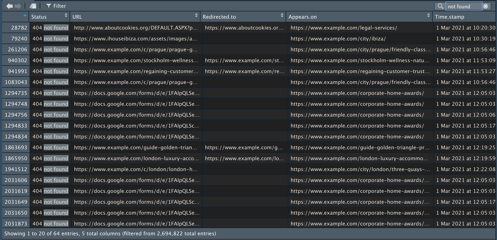
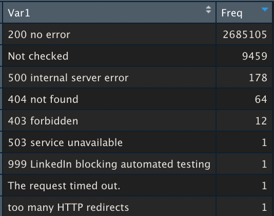
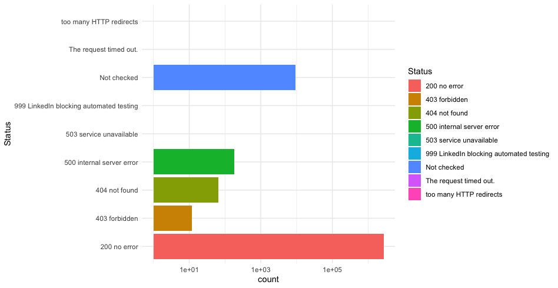
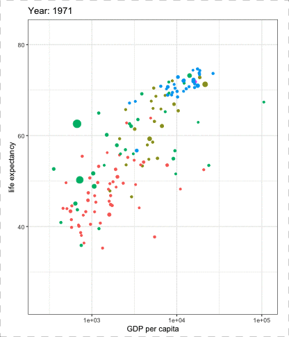
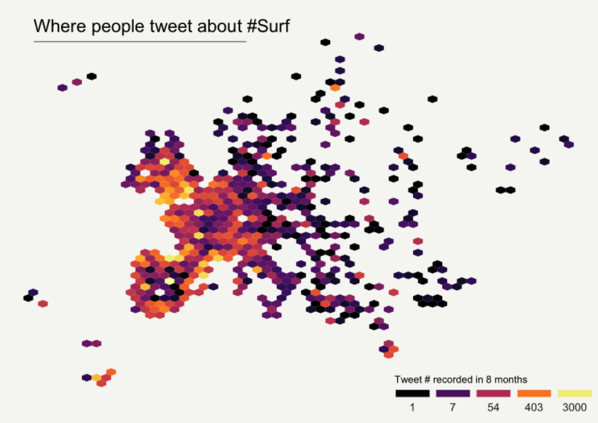
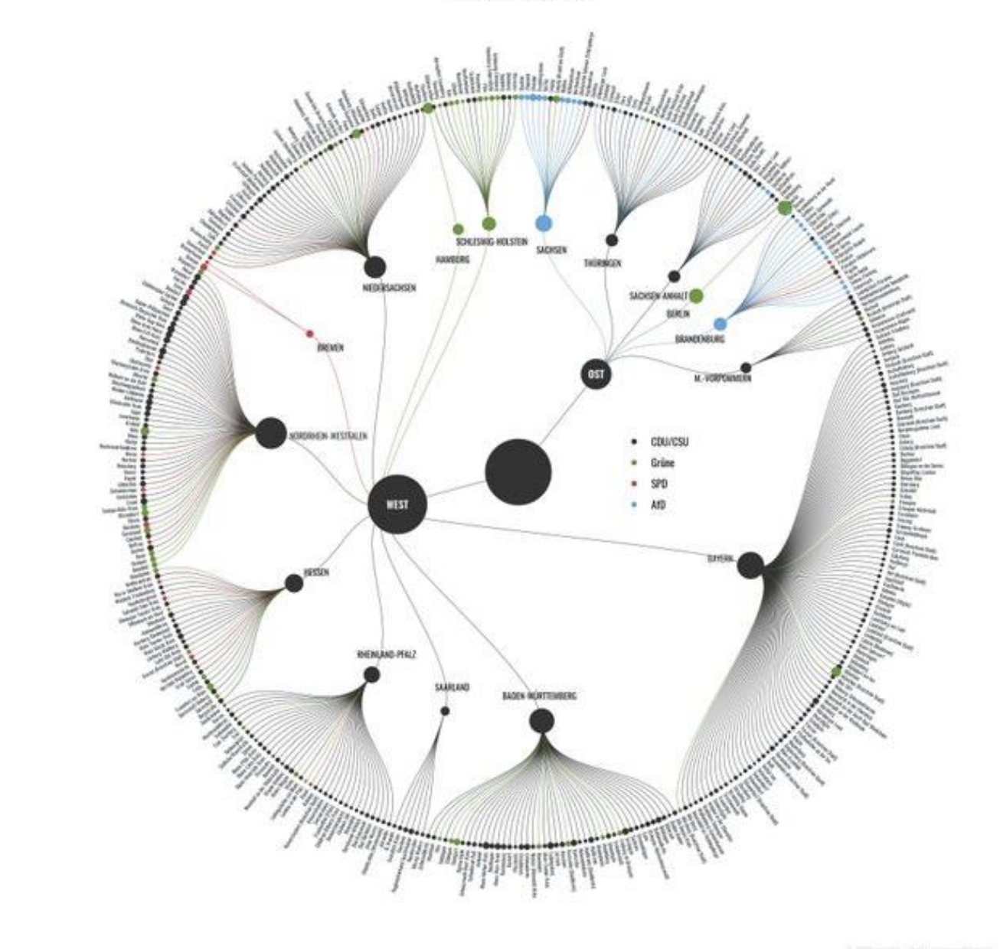
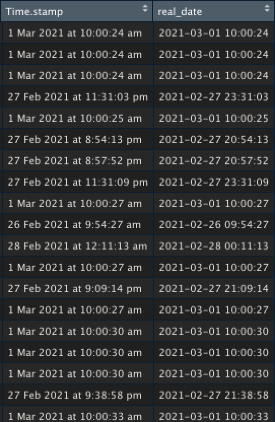
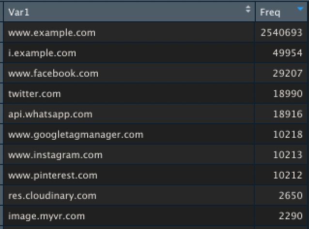

# Using R for SEO, what to expect?

## The power of R. What's different about it?

if we were to talk about only one benefit of R, it's a language High-level programming language that mainly focuses on data analysis. Meaning it's "specialized". With one or a few lines of code, you can do a lot. Let me give you an example:

```r
View(read.csv(file.choose()))
```

This line of code, executed inside [RStudio](classic-r-operations.md#install-and-rstudio), will 

* prompt a select file menu for you to select a CSV  \(_`file.choose`_\)
* It will import data inside R \(_`read.csv`_\) 
* Display it \(_`View`_\)

Let's do it with a website links file


This is how open and **browse a file with 2.6 Million rows effortlessly**. Noticed the small search icon on the top right? Yes, you can search within it quite easily too.



Want to count HTTP code? We will do this in two steps, first we load the CSV file and save it as a variable. Nearly the same as before:

```r
internal_linking = read.csv(file.choose())
```

Then we are going to display the count of Status column values

```r
View(table(internal_linking$Status))
```

You can recognize the `View` function from before. the `table` function just count values. the **`$`** is a shortcut to access column values

It displays:



This is 30 secondes job. The most time-consuming part was to find the file on the hard disk. 

Of course, these are just some silly examples. There is countless way to do this thing \(third party app, terminal, excel pivot and of course python but it gives a nice intro of possibilities and how simple that is.

## _'There is a package for that'_

The real power of R relies on R packages. What's a package you may ask?  It's an on-demand library of functions you can load to help you in specialised tasks. Again let's take some examples.

### ggplot2

It's one of the most famous packages. it can be used to build advanced charts and plots. To use it, you just have to install it once like this

```r
install.packages("ggplot2")
```

to load it

```r
library("ggplot2")
```

and after that, you can now use it

```r
ggplot(internal_linking)+
    aes(x = Status, fill = Status) +
    geom_bar() +
    scale_fill_hue() +
    coord_flip() +
    theme_minimal() +
    scale_y_log10()
```



Let's not go into details for now, but believe it or not, I'm not capable of writing this code, I just googled: "Bar charts chart ggplot" , "flip axis ggplot", "log axis ggplot", ... shamelessly copy-paste the codes.

gggplot2 is powerful, it can make basically every chart you can think of

A few examples of plots done using `ggplot2`







More examples:

* [The R Graph Gallery](https://www.r-graph-gallery.com/)
* [ggplot Wizardry Hands-On](https://z3tt.github.io/OutlierConf2021/)

Let's look at another package

### Lubridate

[Lubridate](https://lubridate.tidyverse.org/) will help to deal with our timestamp values. After the now-classic installing and loading

```r
install.packages("lubridate")
library("lubridate")
```

It can be used to guess and transform this `Time.stamp`into a real date format

```r
internal_linking$real_date = dmy_hms(internal_linking$Time.stamp)
```

The Format has been transformed to a classic format. No more "at" in the middle or "am/pm". It's now easy to read and to sort.  the function guessed sucessfully that the "at" was useless.



now that those are real dates and not string, we can plot them using ggplot

```r
ggplot(internal_linking) +
   aes(x = real_date) +
   geom_histogram() +
   theme_minimal()
```


Lubridate package can also help with duration, time zone, intervals, ... Have a look at the [cheatsheets](https://rawgit.com/rstudio/cheatsheets/master/lubridate.pdf) it is a bit complex to get into but so much less than trying to do it yourself. I've lost literally days of my working life, trying to that this kind of stuff badly in Excel/Google Sheet.

### urltools

One last example for the road. 'Want to extract links domains? You can sure use regex, or even try to split the string using "/" as a separator OR you can use the more reliable `urltools` package which as a dedicated `domain()` function to do exactly that.

```r
# Installing and Loading Package
install.packages("urltools")
library("urltools")
# extract domain and feed it to a new data column called 'domain'
internal_linking$domain <- domain(internal_linking$URL)

```

Let's check out the values, nearly same code as before:

```r
View(table(internal_linking$domain))
```



### Where to find packages?

Good question! All the previous package has been downloaded from CRAN that contains [thousands of packages](https://cran.r-project.org/web/packages/available_packages_by_date.html). Github is also a great source of great packages.   
The problem will be open to pick the right one for you. The best way is usually to ask around using

* Twitter using the \#rstats hashtag
* [reddit](https://www.reddit.com/r/rstats/) , rstudio [forum](https://community.rstudio.com/) are not a bad option
* there are some nice slacks

The community is smaller than other programming languages but people are more willing to help, it compensates.

## The confusing things about R

### The name

> _Oh you do '_R programming'_, that's cool. Is it like_ Air Guitar? You do fake programming?  
> - An anonymous member of my family

"R" is a weird name,  especially in this covid time, and it's not the most Google-friendly name. So here are few sources to help find resources

* [https://rseek.org/](https://rseek.org/) r search engine
* [https://www.r-bloggers.com/](https://www.r-bloggers.com/) r blogs aggregator
* [https://www.bigbookofr.com/](https://www.bigbookofr.com/) all the R free books
* [https://github.com/search?l=R&q=seo&type=code](https://github.com/search?l=R&q=seo&type=code) github r source code search

### the &lt;- 

If you've seen some R' code before and you might have been surprised to see this "&lt;-"  being used. it's just a legacy thing, historically R differentiate  "assignation"  and "comparison", example:

If you want to set the value of X to 3.   _assignation_

```r
x <- 3
```

if you want to make a comparison. _comparison_

```r
if (x = 3) {
    return "the value of X is 3"
}
```

If you want to keep this little _tradition_ alive you can use &lt;- but it is really up to you. Perfectly fine to use **=**

```r
x = 3
x <- 3
```

\(these are actually [very little difference](https://stackoverflow.com/questions/1741820/what-are-the-differences-between-and-assignment-operators-in-r) between two but if you are new to R it's not important at all.\)

#### The %&gt;%

 **%&gt;%** operator, introduced by [magrittr](https://cran.r-project.org/web/packages/magrittr/vignettes/magrittr.html) package, allow operations to be carried out successively. Meaning the results of the previous command are the entries for the next one. Like the **&gt;** \( “pipe”\) command line for terminal if some know about it.

Always better with an example, let's take the first line of code of this page

```r
View(read.csv(file.choose()))
```

It's 3 functions being used on top of each other. It is not great but the readability decent. I wouldn't recommend adding a fourth.  the **%&gt;%** operator fix this problem.

```r
# equivalent to the previous instruction
file.choose() %>% read.csv() %>% View()

# equivalent
file.choose() %>%
 read.csv() %>%
 View()
```

### R' can be slow

I'm going to quote [Hadley Wickham](http://adv-r.had.co.nz/Performance.html) on this one:

> R is not a fast language. This is not an accident. R was purposely designed to make data analysis and statistics easier for you to do. It was not designed to make life easier for your computer. While R is slow compared to other programming languages, for most purposes, it’s fast enough.

My personal experience is all the times my code was really slow it was doing something it shouldn't have done, like recomputing all data to output a new record.

