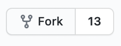

# Launch an R script using github actions

The easiest way to do that is to duplicate this repository on GitHub 



Just push the "Fork" button to create your copy.



Let me explain how it works. It's basically all about two files:

### **sitemap\_scraping.R**

this is the classic R script. It reaches this website [XML sitemap](https://www.rforseo.com/sitemap.xml) and counts the number of url submitted. It relies on `rvest` package \( see [article about rvest](../crawl/rvest.md)  \)

```r
#Load library
library(tidyverse)
library(rvest)

# declare XML sitemap url
url <- 'https://www.rforseo.com/sitemap.xml'

# grab html 

url_html <- read_html(url)

# Select all the <loc>'s
# and count them

nbr_url <- url_html %>% 
  html_nodes("loc")  %>%
  length()

# create a new row of data, with todayd's date and urls number
row <- data.frame(Sys.Date(), nbr_url)

# append at the end of the csv the new data
write_csv(row,paste0('data/xml_url_count.csv'),append = T)   
```

### main.yml

This is where we are going to schedule the process.

```r
name: sitemap_scraping

# Controls when the action will run.
on:
  schedule:
    - cron:  '0 13 * * *'


jobs: 
  autoscrape:
    # The type of runner that the job will run on
    runs-on: macos-latest

    # Load repo and install R
    steps:
    - uses: actions/checkout@master
    - uses: r-lib/actions/setup-r@master

    # Set-up R
    - name: Install packages
      run: |
        R -e 'install.packages("tidyverse")'
        R -e 'install.packages("rvest")'
    # Run R script
    - name: Scrape
      run: Rscript sitemap_scraping.R
      
 # Add new files in data folder, commit along with other modified files, push
    - name: Commit files
      run: |
        git config --local user.name actions-user
        git config --local user.email "actions@github.com"
        git add data/*
        git commit -am "GH ACTION Headlines $(date)"
        git push origin main
      env:
        REPO_KEY: ${{secrets.GITHUB_TOKEN}}
        username: github-actions
```

Parts you may want to modify are 

* the execution frequency rule. It's the weird line with `cron.` this one means " Runs at 13:00 UTC every day." here is the full [syntax documentation](https://docs.github.com/en/actions/reference/events-that-trigger-workflows#scheduled-events). 
* If you are using packages, you need to ask Github to install them before running the script so be sure to include those on the list.


### \*\*\*\* <a id="blob-path"></a>

\*\*\*\*


 

