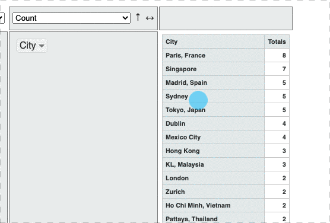
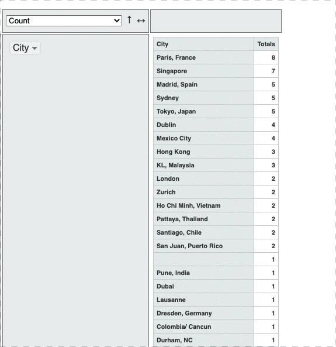

# Explore data with rPivotTable

[rpivotTable](https://cran.r-project.org/web/packages/rpivotTable/vignettes/rpivotTableIntroduction.html) is a great package by Enzo Martoglio that allows you to explore a small dataset using an HTML drag&drop interface that looks like the pivot interface from Google Sheet or Excel.

## Install and load rPivotTable <a id="4-explore-crawled-data-with-rpivottable"></a>

as usual the instruction are quite straightforward

```r
#install package rpivottable to be done once
install.packages("rpivottable")
# And loading 
Library(rpivottable)
```

Imagine you want to explore a data frame called MERGED \( see [how to create a data frame using a CSV file](export-data/send-and-read-seo-data-to-excel.md#read-your-data-from-a-csv) \)

**Its just one line of code**

```r
# launch 
rpivotTable(MERGED)
```

it will open this HTML and drag and dropping KPIs from the left column


You can also use the top dropdown list to make it display a plot instead of a table.


To easily sort



and filter



[Here is a demo HTNL file ](https://www.gokam.co.uk/rpivottable.html)to try it yourself.

